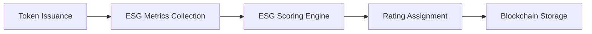
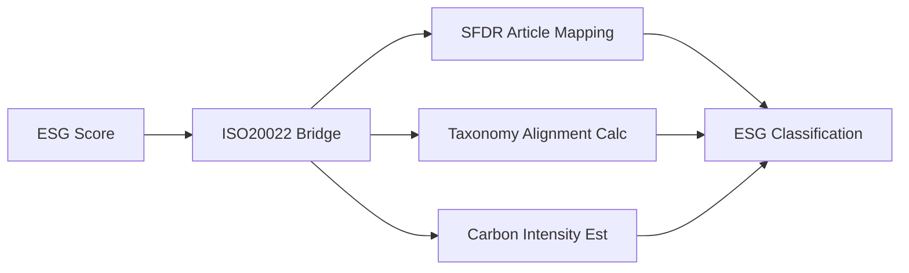
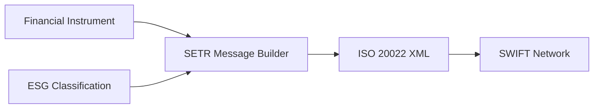

# ERC-8040 ISO 20022 SWIFT Architecture

## System Overview

The ERC-8040 ecosystem bridges blockchain-based ESG compliance with traditional financial infrastructure through ISO 20022 messaging standards.

## Architecture Diagram

```
┌─────────────────────────────────────────────────────────────────────┐
│                         ERC-8040 ECOSYSTEM                          │
├─────────────────────────────────────────────────────────────────────┤
│                                                                     │
│  ┌──────────────┐      ┌──────────────┐      ┌──────────────┐    │
│  │  Smart       │      │  ESG Scoring │      │  Compliance  │    │
│  │  Contract    │◄────►│  Engine      │◄────►│  Validator   │    │
│  └──────────────┘      └──────────────┘      └──────────────┘    │
│         │                      │                      │            │
│         └──────────────────────┼──────────────────────┘            │
│                                ▼                                    │
│                    ┌──────────────────────┐                        │
│                    │  ISO 20022 Bridge    │                        │
│                    │  ┌────────────────┐  │                        │
│                    │  │ ESG → ISO      │  │                        │
│                    │  │ Converter      │  │                        │
│                    │  └────────────────┘  │                        │
│                    │  ┌────────────────┐  │                        │
│                    │  │ SETR Message   │  │                        │
│                    │  │ Generator      │  │                        │
│                    │  └────────────────┘  │                        │
│                    │  ┌────────────────┐  │                        │
│                    │  │ SFDR Mapper    │  │                        │
│                    │  └────────────────┘  │                        │
│                    └──────────────────────┘                        │
│                                │                                    │
└────────────────────────────────┼────────────────────────────────────┘
                                 │
                                 ▼
                     ┌──────────────────────┐
                     │   ISO 20022 XML      │
                     │   ┌──────────────┐   │
                     │   │ SETR.010     │   │ Securities Trade Confirmation
                     │   │ SETR.012     │   │ Order Instruction
                     │   │ SETR.013     │   │ Subscription Confirmation
                     │   └──────────────┘   │
                     └──────────────────────┘
                                 │
                                 ▼
                     ┌──────────────────────┐
                     │   SWIFT Network      │
                     │   ┌──────────────┐   │
                     │   │ Financial    │   │
                     │   │ Institutions │   │
                     │   └──────────────┘   │
                     │   ┌──────────────┐   │
                     │   │ Custodians   │   │
                     │   └──────────────┘   │
                     │   ┌──────────────┐   │
                     │   │ Regulators   │   │
                     │   └──────────────┘   │
                     └──────────────────────┘
```

## Data Flow

### 1. Token Creation & ESG Scoring



**Components:**
- **Smart Contract**: On-chain token with ESG metadata
- **ESG Scoring Engine**: Calculates E/S/G scores and assigns rating (AAA-D)
- **Compliance Validator**: Ensures regulatory compliance

### 2. ISO 20022 Transformation



**Transformation Logic:**
- **SFDR Mapping**: 
  - AAA/AA/A → Article 9 (Sustainable investment)
  - BBB/BB → Article 8 (Promotes ESG)
  - B/CCC/CC/C/D → Article 6 (No sustainability objective)
- **Taxonomy Alignment**: Calculated from environmental score
- **Carbon Intensity**: Inverse relationship to environmental score

### 3. SWIFT Message Generation



**Message Structure:**
- **FinInstrmId**: ISIN, LEI, Instrument Name
- **ESGClssfctn**: Custom ESG extension
  - TaxnmyAlgnmt (EU Taxonomy %)
  - SFDRArtcl (6, 8, or 9)
  - ERC8040Rtg (AAA-D rating)

### 4. Traditional Finance Integration

```
SWIFT Network → Financial Institutions → Regulatory Reporting
                      ↓
              Portfolio Management
                      ↓
              ESG Investment Decisions
```

## Component Descriptions

### ISO20022Bridge

**Purpose**: Core translation layer between ERC-8040 and ISO 20022

**Functions:**
- `esg_to_iso()`: Convert ESG score to ISO classification
- `map_sfdr_article()`: Determine SFDR article from rating
- `calculate_taxonomy_alignment()`: Calculate EU Taxonomy %
- `create_setr_message()`: Generate ISO 20022 XML

### ESG Classification

**Structure:**
```
{
  "taxonomy_alignment": 85.0,    // 0-100%
  "sfdr_article": 9,              // 6, 8, or 9
  "erc8040_rating": "AA",         // AAA to D
  "carbon_intensity": 75.0        // tCO2e/$M revenue
}
```

### Financial Instrument

**Identifiers:**
- **ISIN**: International Securities Identification Number
- **LEI**: Legal Entity Identifier  
- **Name**: Human-readable instrument name

## SFDR Article Classification

| ERC-8040 Rating | Score Range | SFDR Article | Description |
|----------------|-------------|--------------|-------------|
| AAA, AA, A     | 80-100      | Article 9    | Sustainable investment objective |
| BBB, BB        | 60-79       | Article 8    | Promotes environmental/social characteristics |
| B, CCC, CC, C, D | 0-59      | Article 6    | No sustainability objective |

## EU Taxonomy Alignment Calculation

```
If environmental_score >= 80:
    taxonomy_alignment = min(environmental_score, 100)
Else if environmental_score >= 60:
    taxonomy_alignment = (environmental_score - 60) * 2
Else:
    taxonomy_alignment = 0
```

## Security & Compliance

- **Data Integrity**: Blockchain immutability ensures ESG scores cannot be manipulated
- **Audit Trail**: All ESG updates and classifications are logged on-chain
- **Regulatory Compliance**: Automated SFDR and EU Taxonomy reporting
- **Standard Conformance**: Full ISO 20022 schema compliance

## Deployment Scenarios

### 1. Green Bond Issuance
Token issuer creates ESG-compliant bond → ISO 20022 message → SWIFT distribution to institutional investors

### 2. ESG Portfolio Reporting
Asset manager aggregates ERC-8040 holdings → Generate SFDR reports → Submit via SWIFT to regulators

### 3. Cross-Border ESG Trading
Trade ESG tokens on DeFi → Convert to ISO 20022 → Settle through traditional banking rails

## Technical Requirements

- **Blockchain**: Ethereum-compatible (EVM)
- **Message Format**: ISO 20022 XML Schema
- **Network**: SWIFT connectivity (for production)
- **Compliance**: SFDR, EU Taxonomy, MiFID II

## Performance Characteristics

- **Conversion Time**: < 100ms for ESG to ISO transformation
- **Message Size**: ~2-5KB typical SETR message with ESG data
- **Throughput**: Supports high-frequency trading scenarios
- **Scalability**: Stateless bridge design allows horizontal scaling

## Future Enhancements

- Support for additional ISO 20022 message types (CAMT, PAIN)
- Real-time ESG score updates via oracle integration
- Machine learning-based taxonomy alignment predictions
- Multi-framework support (TCFD, GRI, SASB)

## References

- [ISO 20022 Standard](https://www.iso20022.org/)
- [SFDR Regulation](https://ec.europa.eu/info/business-economy-euro/banking-and-finance/sustainable-finance/sustainability-related-disclosure-financial-services-sector_en)
- [EU Taxonomy](https://ec.europa.eu/info/business-economy-euro/banking-and-finance/sustainable-finance/eu-taxonomy-sustainable-activities_en)
- [ERC-8040 Specification](https://github.com/agronetlabs/erc-8040-ecosystem)
